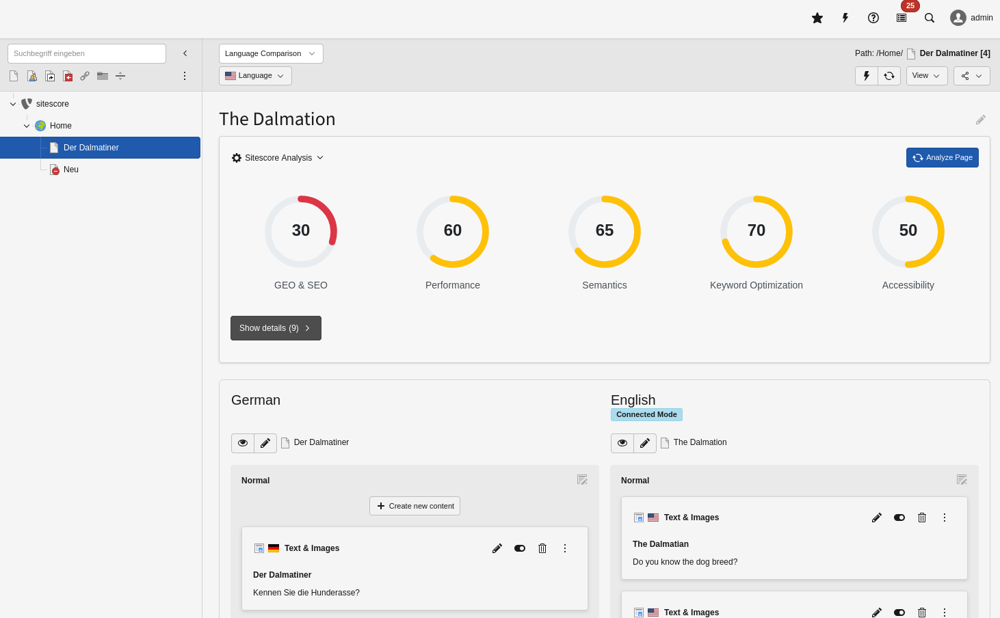
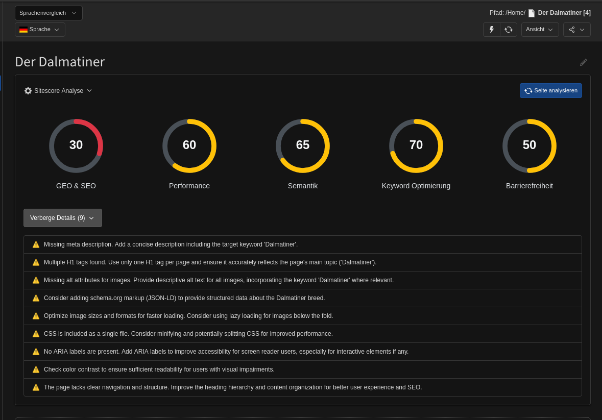

# Sitescore - AI-powered SEO/GEO and Content Quality Dashboard for TYPO3

## Introduction

Sitescore provides an at-a-glance SEO/GEO and content quality dashboard directly in the TYPO3 page module. 
It displays key metrics as visual score gauges inspired by Google Pagespeed, helping editors identify and fix content 
issues without leaving the backend.

The extension analyzes pages using AI (Google Gemini by default) and provides scores for 5 categories:

- **GEO & SEO**: Generative Engine Optimization and Search Engine Optimization
- **Performance**: Page structure, image optimization, CSS/JS inclusion
- **Semantics**: HTML5 semantics, heading hierarchy, ARIA labels
- **Keyword Optimization**: Keyword usage based on `pages.tx_sitescore_keyword` field
- **Accessibility**: WCAG compliance, keyboard navigation, screen reader support

Each analysis includes actionable suggestions to improve your content quality and SEO rankings.

## Screenshots



*Sitescore dashboard integrated in TYPO3 page module*



*Analysis results with suggestions (dark mode)*

## Google Gemini API

- To use the extension, you need a **Google Gemini API** key. You can register for one at https://aistudio.google.com/app/api-keys.
- Alternatively, you can implement your own LLM provider (see [Custom LLM Integration](#custom-llm-integration) below).

## Installation

### With composer

```
composer req in2code/sitescore
```

### Main configuration

After installation, configure the extension in Extension Manager or via environment variables:

| Title    | Default value | Description                                                                                                                                           |
|----------|---------------|-------------------------------------------------------------------------------------------------------------------------------------------------------|
| apiKey   | -             | Google Gemini API key. You can leave this empty and use the `GOOGLE_API_KEY` environment variable instead (recommended for CI/CD pipelines)           |

**Recommended:** Use environment variables instead of saving the API key in Extension Manager:

```
GOOGLE_API_KEY=your_api_key_from_google
```

## Usage

### In the Page Module

1. Navigate to the **Page** module in TYPO3 backend
2. Select a page in the page tree
3. You'll see the **Sitescore Analysis** section at the top
4. Click **"Analyze Page"** to perform a new analysis
5. View the scores and suggestions by expanding the results

### CLI Commands

#### Analyze a single page or page tree

Analyzes pages automatically with a scheduler command

```
# Analyze single page
./vendor/bin/typo3 sitescore:analyzePage 123

# Analyze page tree recursively (page + all subpages with 99 recursion level)
./vendor/bin/typo3 sitescore:analyzePage 123 99
```

#### Clear all analysis data

This removes all stored analysis results from the database. Useful for fresh starts or testing.

```
# Truncate all analysis records!
./vendor/bin/typo3 sitescore:truncateAnalysis
```

## Custom LLM Integration (like ChatGPT, Claude, Copilot, Mistral, etc...)

Sitescore uses a factory pattern to allow custom LLM providers. By default, it uses Google Gemini, 
but you can easily integrate other AI services (OpenAI, Claude, local models, etc.).

### Implementing a Custom LLM Repository

1. Create a custom repository class implementing `LlmRepositoryInterface` - see example for Mistral AI::

```
<?php

declare(strict_types=1);

namespace In2code\SitescoreTest\Domain\Repository\Llm;

use In2code\Sitescore\Domain\Repository\Llm\AbstractRepository;
use In2code\Sitescore\Domain\Repository\Llm\RepositoryInterface;
use In2code\Sitescore\Exception\ApiException;
use In2code\Sitescore\Exception\ConfigurationException;
use TYPO3\CMS\Core\Http\RequestFactory;

class MistralRepository extends AbstractRepository implements RepositoryInterface
{
    private string $apiKey = '';
    private string $apiUrl = 'https://api.mistral.ai/v1/chat/completions';

    public function __construct(
        protected RequestFactory $requestFactory,
    ) {
        // Get API key from environment variable or extension configuration
        $this->apiKey = getenv('MISTRAL_API_KEY') ?: '';
    }

    public function checkApiKey(): void
    {
        if ($this->apiKey === '') {
            throw new ConfigurationException('Mistral API key not configured', 1735200000);
        }
    }

    public function getApiUrl(): string
    {
        return $this->apiUrl;
    }

    public function getOptions(string $html, string $pageTitle, string $keyword): array
    {
        $prompt = $this->getPrompt($html, $pageTitle, $keyword);

        return [
            'headers' => [
                'Authorization' => 'Bearer ' . $this->apiKey,
                'Content-Type' => 'application/json',
            ],
            'body' => json_encode([
                'model' => 'mistral-large-latest',
                'messages' => [
                    [
                        'role' => 'user',
                        'content' => $prompt,
                    ],
                ],
                'temperature' => 0.1,
                'max_tokens' => 2048,
            ]),
        ];
    }

    public function analyzePageContent(string $html, string $pageTitle, string $keyword): array
    {
        $this->checkApiKey();
        return $this->generateAnalysis($html, $pageTitle, $keyword);
    }

    protected function generateAnalysis(string $html, string $pageTitle, string $keyword): array
    {
        $response = $this->requestFactory->request(
            $this->getApiUrl(),
            'POST',
            $this->getOptions($html, $pageTitle, $keyword)
        );

        if ($response->getStatusCode() !== 200) {
            throw new ApiException(
                'Failed to analyze page with Mistral: ' . $response->getBody()->getContents(),
                1735200001
            );
        }

        $responseData = json_decode($response->getBody()->getContents(), true);
        return $this->parseResponse($responseData);
    }

    protected function parseResponse(array $responseData): array
    {
        if (isset($responseData['choices'][0]['message']['content']) === false) {
            throw new ApiException('Invalid Mistral API response structure', 1735200002);
        }

        $text = $responseData['choices'][0]['message']['content'];

        // Extract JSON from markdown code blocks if present
        if (preg_match('/```json\s*(\{.*?\})\s*```/s', $text, $matches)) {
            $text = $matches[1];
        } elseif (preg_match('/```\s*(\{.*?\})\s*```/s', $text, $matches)) {
            $text = $matches[1];
        }

        $data = json_decode($text, true);
        if ($data === false || isset($data['scores']) === false || isset($data['suggestions']) === false) {
            throw new ApiException('Could not parse Mistral response as JSON', 1735200003);
        }

        return $data;
    }
}
```

2. Register your custom repository in `ext_localconf.php`:

```
<?php
defined('TYPO3') || die();

// Register custom LLM repository
$GLOBALS['TYPO3_CONF_VARS']['EXTENSIONS']['sitescore']['llmRepositoryClass']
    = \Vendor\MyExtension\Repository\MyCustomLlmRepository::class;
```

3. Clear TYPO3 caches:

```
./vendor/bin/typo3 cache:flush
```

Your custom LLM provider will now be used for all content analysis instead of Google Gemini.

## Changelog

| Version | Date       | State | Description                                                              |
|---------|------------|-------|--------------------------------------------------------------------------|
| 1.0.0   | 2025-12-30 | Task  | Initial release with Google Gemini integration and 5 analysis categories |

## Contribution with DDEV

This repository provides a [DDEV](https://ddev.readthedocs.io)-backed development environment. 
If DDEV is installed, simply run the following commands to quickly set up a local environment:

```
ddev start
```

**URLs:**
- Web: https://sitescore.ddev.site
- Backend: https://sitescore.ddev.site/typo3

**Backend Login:**
```
Username: admin
Password: admin
```

**Installation requirements:**

1. Install DDEV: https://ddev.readthedocs.io/en/stable/#installation
2. Install git-lfs: https://git-lfs.github.com/
3. (Optional) Create `.ddev/.env` with your Google API key:

```
GOOGLE_API_KEY=your_api_key_from_google
```

**Development commands:**

```
# Install dependencies
ddev composer install

# Flush TYPO3 cache
ddev exec .Build/bin/typo3 cache:flush

# Analyze a page
ddev exec .Build/bin/typo3 sitescore:analyzePage 1

# Access database
ddev mysql
```
